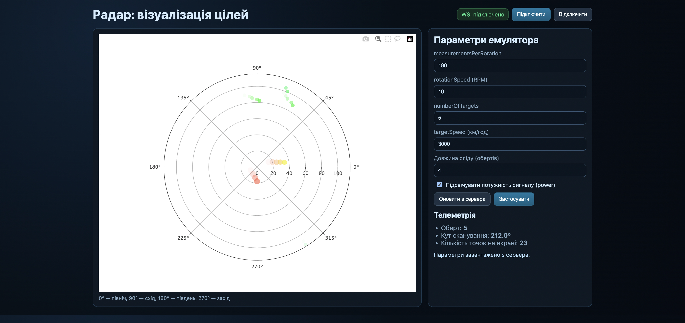
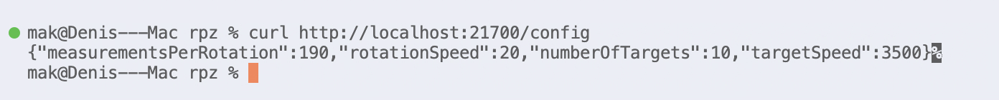

# Лабораторно-практичне заняття №2 — Візуалізація вимірювань радару

## 1. Короткий опис роботи

**Мета:** реалізувати веб-додаток, який у реальному часі підключається до емулятора вимірювальної частини радару, обробляє дані сканування та відображає задетектовані цілі в полярних координатах.

**Реалізовано (обов’язковий мінімум):**
- підключення до `WebSocket` сервера `ws://localhost:21700`;
- обробка повідомлень формату `{ scanAngle, echoResponses[] }`;
- перерахунок часу проходження сигналу у відстань за формулою:

$$
R = \frac{c\cdot t}{2}, \quad c = 300000\ \text{км/с}
$$

- візуалізація точок `(кут, відстань)` на полярному графіку (`Plotly`);
- налаштування полярної осі під «радарний» азимут: `direction = clockwise`;
- збереження точок попередніх обертів із поступовим згасанням (ефект сліду цілей).

**Додатково виконано:**
- UI для зміни параметрів емулятора через `PUT /config`;
- завантаження поточних параметрів через `GET /config`;
- опційне кодування `power` кольором/розміром точки (через логарифмічне нормування).

## 2. Інструкції для запуску

### 2.1. Запуск емулятора радару (Docker)

1. Завантажити image:

```bash
docker pull iperekrestov/university:radar-emulation-service-2026
```

2. Запустити контейнер:

```bash
docker run --rm --name radar-emulator -p 21700:21700 iperekrestov/university:radar-emulation-service-2026
```

3. Перевірити, що сервіс працює:

```bash
curl http://localhost:21700/config
```

### 2.2. Запуск веб-додатку

1. Перейти в каталог роботи:

```bash
cd pr-2
```

2. Запустити локальний HTTP-сервер (будь-який варіант):

```bash
python3 -m http.server 8080
```

або

```bash
npx serve .
```

3. Відкрити в браузері:

- якщо `python3 -m http.server`: `http://localhost:8080`
- якщо `npx serve`: адресу з консолі (зазвичай `http://localhost:3000`)

## 3. Структура проєкту

- `index.html` — розмітка сторінки, панель керування, контейнер графіка.
- `style.css` — стилізація інтерфейсу (темна «радарна» тема).
- `app.js` — підключення до WebSocket, обробка даних, побудова/оновлення графіка, API-конфігурація.

## 4. Результат

Після запуску застосунок:
- автоматично підключається до WebSocket;
- показує цілі в полярних координатах (азимут + відстань у км);
- зберігає слід цілей на кілька обертів із поступовим згасанням;
- дозволяє змінювати `measurementsPerRotation`, `rotationSpeed`, `numberOfTargets`, `targetSpeed` прямо з UI.


Після зміни конфігу

## 5. Висновки

У ході роботи закріплено:
- практику роботи з `Docker`-сервісом;
- приймання потоку вимірювань через `WebSocket`;
- перетворення часу поширення імпульсу у відстань за фізичною моделлю радара;
- побудову «живої» полярної візуалізації з ефектом післясвічення та керуванням параметрами емулятора через HTTP API.
